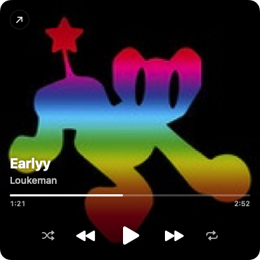

# Tidal Mini Player

A macOS **menu bar** mini player for the TIDAL desktop app, written in Swift
(SwiftUI + AppKit — a custom `NSStatusItem` with a borderless SwiftUI panel). It
shows the current track in the menu bar and,
when clicked, opens a compact player styled after TIDAL's own mini player —
full-bleed album art with the title, artist, a live progress bar, and
previous / play-pause / next controls overlaid on top.



## Build & run

```bash
./build.sh
open "build/Tidal Mini Player.app"
```

No Xcode project needed — `build.sh` compiles the Swift with `swiftc`, builds the
bundled `MediaRemoteAdapter.framework` with `clang`, and assembles a proper
`.app` bundle (`LSUIElement`, so no Dock icon). It needs **no permissions**.

To keep it around: drag `build/Tidal Mini Player.app` into `/Applications`, then
add it under **System Settings → General → Login Items** to start it at login.

## How it works

macOS exposes "Now Playing" info through the private **MediaRemote** framework.
Since **macOS 15.4**, `mediaremoted` requires a private entitlement, so an
ordinary third-party app gets *nothing* back — and can't send transport commands
either. The reliable, SIP-free way around this (from
[ungive/mediaremote-adapter](https://github.com/ungive/mediaremote-adapter)) is to
go through **`/usr/bin/perl`**, which is Apple-signed, *is* entitled, and — unlike
`osascript` — is not library-validated, so it can dynamically load a small helper
framework:

- **Reading the track** — the app launches
  `perl mediaremote-adapter.pl <framework> stream` once and reads a live stream of
  JSON updates (pushed via MediaRemote notifications, so the data is always fresh —
  no polling, no stale/empty reads). Each update carries title, artist, album,
  duration, position, play state, the source app's bundle id, and the album
  artwork as base64.
- **Album art** — comes straight from that payload, so it's the *exact* TIDAL
  cover, decoded to an `NSImage`.
- **Controls** — play/pause/next/previous/shuffle/repeat run
  `perl mediaremote-adapter.pl … send <id>`, dispatching a real MediaRemote
  command from the entitled perl process — **no permission**. A MediaRemote
  command is global (it hits whatever owns the Now Playing slot), so the buttons
  only act when **TIDAL owns the slot**; when another app owns it (e.g. a paused
  browser video) they do nothing rather than control the wrong player.

The `MediaRemoteAdapter.framework` is compiled from vendored BSD-3 sources under
[`ThirdParty/mediaremote-adapter/`](ThirdParty/mediaremote-adapter) (see its
`LICENSE`) and bundled into the app's `Resources`.

### Files

| File | Role |
|------|------|
| `Sources/App.swift` | Status item + custom borderless player panel |
| `Sources/NowPlaying.swift` | Track model, payload parsing, live-position extrapolation |
| `Sources/AdapterClient.swift` | Runs the perl adapter: stream in, commands out |
| `Sources/NowPlayingStore.swift` | Consumes the stream, decodes artwork, routes controls |
| `Sources/ArtworkProvider.swift` | High-res cover lookup (iTunes Search) |
| `Sources/PlayerView.swift` | The TIDAL-style player UI (track + idle states) |
| `ThirdParty/mediaremote-adapter/` | Vendored adapter sources + perl loader (BSD-3) |

## Notes & limitations

- **One "Now Playing" slot.** macOS tracks a single system-wide now-playing app,
  and there's no API to read a specific background app. So if you start a video
  in a browser while TIDAL plays, the browser takes the slot and TIDAL stops
  being reported. The player handles this by **keeping the last TIDAL track on
  screen** (it's almost certainly still playing) until TIDAL reclaims the slot —
  rather than blanking out. The trade-off: if you actually stop TIDAL while
  another app holds the slot, the last track may linger until TIDAL is active
  again.
- The app is **ad-hoc code-signed**; Gatekeeper may warn on first launch
  (right-click → Open).
- Tested on macOS 26 (Apple silicon). The adapter approach targets macOS 15.4+
  and also works on earlier versions. `build.sh` produces a **universal**
  (`arm64` + `x86_64`) binary, so it runs natively on Apple silicon and Intel.

## Credits

Now-playing access uses [mediaremote-adapter](https://github.com/ungive/mediaremote-adapter)
by Jonas van den Berg (BSD 3-Clause).
